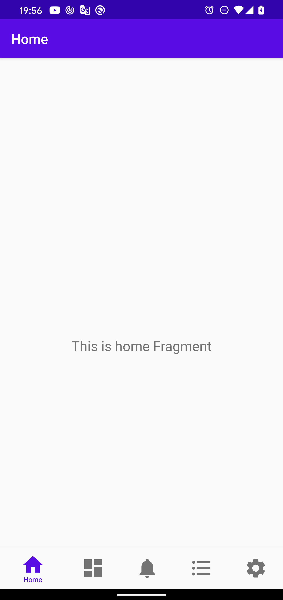
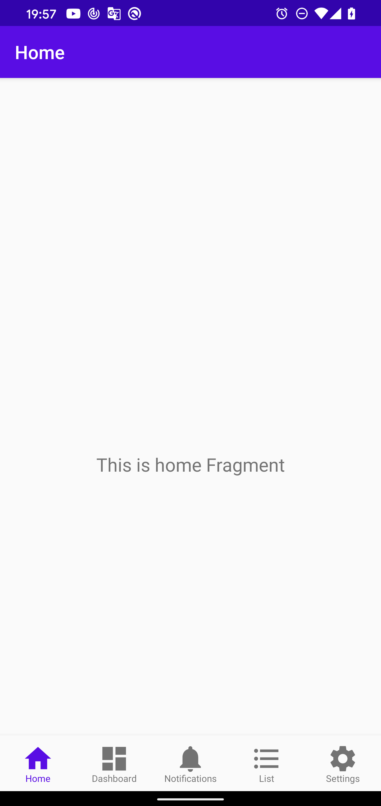

# BottomNavigationView Sample

## IDs

The item id in menu.xml and its corresponding fragment's id in navigation.xml must be the same.

ex. (@+id/navigation_home)

```xml
<?xml version="1.0" encoding="utf-8"?>
<menu xmlns:android="http://schemas.android.com/apk/res/android">

    <item
        android:id="@+id/navigation_home"
        android:icon="@drawable/ic_home_black_24dp"
        android:title="@string/title_home" />

    ...
</menu>
```

```xml
<?xml version="1.0" encoding="utf-8"?>
<navigation xmlns:android="http://schemas.android.com/apk/res/android"
    xmlns:app="http://schemas.android.com/apk/res-auto"
    xmlns:tools="http://schemas.android.com/tools"
    android:id="@+id/mobile_navigation"
    app:startDestination="@+id/navigation_home">

    <androidx.fragment.app.FragmentContainerView
        android:id="@+id/navigation_home"
        android:name="org.mightyfrog.android.bottomnavigationviewsample.ui.home.HomeFragment"
        android:label="@string/title_home"
        tools:layout="@layout/fragment_home" />

    ...
</navigation>
```

## Change text size

Override these two dimen attributes:

- design_bottom_navigation_text_size
- design_bottom_navigation_active_text_size

ex.

```xml
<dimen name="design_bottom_navigation_text_size" tools:override="true">10sp</dimen>
<dimen name="design_bottom_navigation_active_text_size" tools:override="true">10sp</dimen>
```

## Change icon size

Set **app:itemIconSize** in the BottomNavigationView tag.

ex.

```xml
<com.google.android.material.bottomnavigation.BottomNavigationView
    ...
    app:itemIconSize="34dp"
    ...
    ... />
```

## Display icons and texts at all time

Set **app:labelVisibilityMode="labeled"** in the BottomNavigationView tag.

ex.

```xml
<com.google.android.material.bottomnavigation.BottomNavigationView
    ...
    app:labelVisibilityMode="labeled"
    ...
    ... />
```

|selected|labeled|unlabeled|
|:--:|:--:|:--:|
||||

## Add extra space between icon and text

Override **design_bottom_navigation_height** to increase the height of BottomNavigationView.

ex.

```xml
<dimen name="design_bottom_navigation_height" tools:override="true">60dp</dimen>
```

## Change the back button behavior

Remove **app:defaultNavHost="true"** or set it to false so the back button doesn't defaults to the start destination (app:startDestination="@+id/navigation_home" in mobile_navigation.xml).

ex.

```xml
<fragment
    ...
    app:defaultNavHost="true"
    ...
    ... />
```
